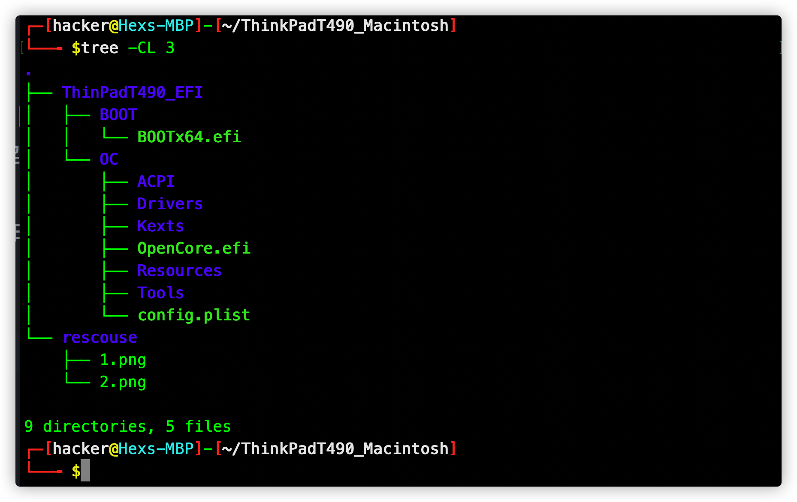

# ThinPad T490 Macintosh EFI
## 先放预览图

### about....
`Github`上有个大佬做了`ThinkPad T490`的`oc`，我实际用的时候发现了一些自己解决不了，而且google也没有的问题
只能自己从0到1走了一遍`OC`，用到的补丁是来自于`yusifsalam`这个大佬

项目地址：

https://github.com/yusifsalam/t490-macos

项目文件概览如下:

## 一些基本的配置
Name|Value
-|-
System Version|Macos Big Sur 11.2
OpenCore Version|0.72
CPU|Intel i5-8265U
Memory|16GB/2400Mhz                       
Storage| WDC WDS100T/1T
Display| 14" non-touch 1920x1080
GPU|Intel UHD620
Camera| 720p with Windows Hello IR sensor
WLAN|Intel Wireless-AC 9560 2x2ac with BT5.0
Battery|Single 3-cell 50Wh
Touchpad|Synaptics TM3471-010  

## 成功驱动的
- [x] 键盘驱动，亮度还有声音都没有问题
- [x] 电池
- [x] 显卡驱动，基本可以完美控制亮度
- [x] 声卡驱动
- [x] GPU加速没问题
- [ ] 摄像头不能运行，因为是纯工作，所以用不到
- [x] 扬声器和话筒问题
- [ ] 蓝牙不能用
- [x] 可以睡眠，唤醒会有显示缩小闪屏等问题
- [x] 触摸板完美运行，但是thinkpad触摸板的手感很差，导致体验很差
- [x] 电池驱动和电源管理没有问题
- [ ] HDMI不能用
- [ ] Handoff接力是可以的
- [ ] AirPlay用不了
- [x] FileVault可以用
- [x] Thunderbolt接口可以用
